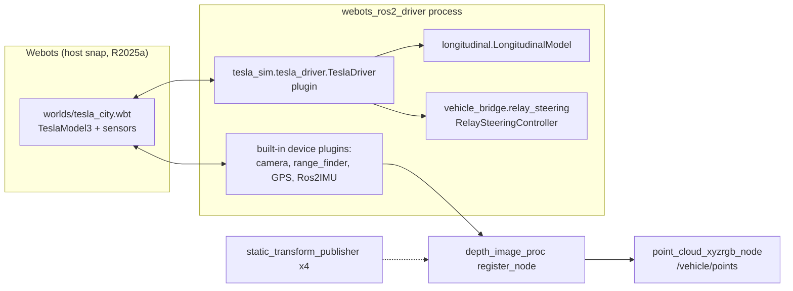

# Components

| Path | Role |
| --- | --- |
| `worlds/tesla_city.wbt` | The city world: a loop of roads and two intersections, buildings, barriers, pedestrian crossings, the `TeslaModel3` with a camera, range finder, GPS, accelerometer and gyro in its front sensor slot. All `EXTERNPROTO`s are pinned to the `R2025a` tag |
| `resource/tesla.urdf` | Tells `webots_ros2_driver` which devices to expose and loads the plugins: camera and range finder (optical frame names), `Ros2IMU` (gyro + accelerometer only), and `TeslaDriver` with its properties (`cmdTimeout`, `maxSteeringDeg`, `coastDecel`, `driveTimeConstant`) |
| `tesla_sim/tesla_driver.py` | The plugin. Every Webots step: reads commands, advances relay steering, applies Ackermann wheel angles, advances the longitudinal model, sets rear-wheel velocities, publishes measured speed and steering angle |
| `tesla_sim/longitudinal.py` | Pure-Python speed model: first-order throttle lag, coast-only deceleration, instant emergency brake. Unit-tested (`test/test_longitudinal.py`) |
| `tesla_sim/ackermann_teleop_keyboard.py` | Keyboard teleop publishing `AckermannDrive` (km/h + steering angle), one message per key press |
| `launch/tesla_sim.launch.py` | Starts Webots, the Ros2Supervisor, the driver (`respawn=True`, `respawn_delay=2.0`), `register_node`, the coloured and plain cloud nodes, four static transforms, optional RViz and the optional upstream lane follower. Shuts everything down when Webots exits |
| `config/tesla_sim.rviz` | RViz layout (fixed frame `range_finder`) |
| `scripts/run_tesla_sim.sh` | Portable launcher: detects `WEBOTS_HOME` (snap or source build), the ROS distro and the Qt plugin path; does **not** set `ROS_DOMAIN_ID` or `CYCLONEDDS_URI` |

Dependencies: `vehicle_bridge` must be in the same workspace, because the
driver imports `RelaySteeringController` from it
([D-010](../03-decisions/D-010-relay-steering-shared-with-vehicle-bridge.md)).

## Why the plugin drives motors directly

The Webots vehicle `Driver` API (`setCruisingSpeed`, `setSteeringAngle`) does
nothing in this stack; see
[D-003](../03-decisions/D-003-drive-wheel-motors-directly.md) and
[webots-api-and-plugins.md](../07-bugs-and-lessons/webots-api-and-plugins.md).
The plugin therefore sets `left_rear_wheel`/`right_rear_wheel` velocities and
`left_steer`/`right_steer` positions itself.
