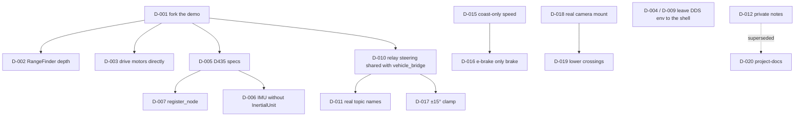

# 03 · Decisions

One page per decision, ADR-style: context, the decision, alternatives and
consequences. Don't edit a decision to reverse it: add a new one that
supersedes it and change the old one's status.

**Statuses:** *Accepted* · *Standing preference* (an explicit owner choice;
don't re-propose without new evidence) · *Superseded by D-NNN*

| ID | Date | Decision | Status |
| --- | --- | --- | --- |
| [D-001](D-001-fork-a-custom-package.md) | 2026-09-08 | Build a custom package instead of extending the demo | Accepted |
| [D-002](D-002-rangefinder-depth-not-simulated-stereo.md) | 2026-09-08 | Ground-truth `RangeFinder` depth, not simulated stereo | Accepted |
| [D-003](D-003-drive-wheel-motors-directly.md) | 2026-09-08 | Drive wheel motors directly (Driver API is a no-op) | Accepted |
| [D-004](D-004-do-not-hardcode-ros-domain-id.md) | 2026-09-08 | Don't hardcode `ROS_DOMAIN_ID` in the run script | Standing preference |
| [D-005](D-005-calibrate-sensors-to-d435.md) | 2026-09-09 | Calibrate camera and depth to D435 specs | Accepted |
| [D-006](D-006-imu-without-inertial-unit.md) | 2026-09-09 | IMU from gyro + accelerometer only | Accepted |
| [D-007](D-007-register-depth-with-register-node.md) | 2026-09-09 | Register depth to colour with `register_node` | Accepted |
| [D-008](D-008-stop-the-sim-with-a-sigint-cascade.md) | 2026-09-09 | Stop the sim with a SIGINT cascade | Accepted |
| [D-009](D-009-do-not-override-cyclonedds-uri.md) | 2026-09-09 | Don't override `CYCLONEDDS_URI` in the run script | Standing preference |
| [D-010](D-010-relay-steering-shared-with-vehicle-bridge.md) | 2026-09-09 | Relay steering via vehicle_bridge's shared controller | Accepted |
| [D-011](D-011-publish-under-the-real-carts-topic-names.md) | 2026-09-09 | Publish under the real cart's topic names | Accepted |
| [D-012](D-012-two-tier-documentation.md) | 2026-09-09 | Shared README + private notes | Superseded by D-020 |
| [D-013](D-013-own-repository.md) | 2026-09-13 | tesla_sim becomes its own repository | Accepted |
| [D-014](D-014-portable-run-script.md) | 2026-10-06 | Portable run script (snap or source Webots, Humble or Jazzy) | Accepted |
| [D-015](D-015-cart-like-longitudinal-model.md) | 2026-10-08 | Throttle lag and coast-only slowing | Accepted |
| [D-016](D-016-emergency-brake-is-the-only-brake.md) | 2026-10-08 | `/vehicle/emergency_brake` is the only brake | Accepted |
| [D-017](D-017-clamp-steering-to-15-degrees.md) | 2026-10-08 | Clamp steering to ±15° | Accepted |
| [D-018](D-018-camera-mount-from-campus-bag.md) | 2026-10-08 | Sensor mount from the campus bag | Accepted |
| [D-019](D-019-lower-pedestrian-crossings.md) | 2026-10-08 | Lower the pedestrian crossings | Accepted |
| [D-020](D-020-project-docs-replace-private-notes.md) | 2026-10-09 | `project-docs/` replaces private notes | Accepted |

## How the decisions connect

